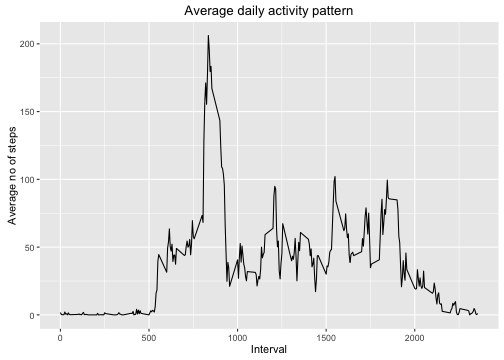

## 1 Load data into current working directory

```r
fileUrl <- "https://d396qusza40orc.cloudfront.net/repdata%2Fdata%2Factivity.zip"
download.file(fileUrl,destfile="./repdata_data_activity.zip",method="curl")
```

#### File is unziped into the same directory without changing inherit path structure


```r
unzip(zipfile="./repdat_data_activity.zip",exdir="./")
```

```
## Warning in unzip(zipfile = "./repdat_data_activity.zip", exdir = "./"):
## error 1 in extracting from zip file
```

```r
activity <- read.csv("activity.csv")
```

```
## Warning in file(file, "rt"): cannot open file 'activity.csv': No such file
## or directory
```

```
## Error in file(file, "rt"): cannot open the connection
```

```r
dim(activity)
```

```
## [1] 17568     3
```

```r
#  [1] 17568     3
```


```r
str(activity)
```

```
## 'data.frame':	17568 obs. of  3 variables:
##  $ steps   : int  NA NA NA NA NA NA NA NA NA NA ...
##  $ date    : Factor w/ 61 levels "2012-10-01","2012-10-02",..: 1 1 1 1 1 1 1 1 1 1 ...
##  $ interval: int  0 5 10 15 20 25 30 35 40 45 ...
```


```r
summary(activity)
```

```
##      steps                date          interval     
##  Min.   :  0.00   2012-10-01:  288   Min.   :   0.0  
##  1st Qu.:  0.00   2012-10-02:  288   1st Qu.: 588.8  
##  Median :  0.00   2012-10-03:  288   Median :1177.5  
##  Mean   : 37.38   2012-10-04:  288   Mean   :1177.5  
##  3rd Qu.: 12.00   2012-10-05:  288   3rd Qu.:1766.2  
##  Max.   :806.00   2012-10-06:  288   Max.   :2355.0  
##  NA's   :2304     (Other)   :15840
```


## 2 What is mean total number of steps taken per day?


#### number of records without NA`s

```r
activity_nna = activity[!is.na(activity$steps), ]  
dim(activity_nna)
```

```
## [1] 15264     3
```


```r
activity.date <- aggregate(activity_nna$steps, list(activity_nna$date), sum)
colnames(activity.date) <- c("date", "steps")
dim(activity.date)
```

```
## [1] 53  2
```


#### Histogram of total numbers of steps taken per day

```r
library(ggplot2)
ggplot(data=activity.date, aes(x=steps)) +
     geom_histogram(fill="#334499") +  
     ggtitle("Steps taken per day") +
     labs(x="Number of steps per day", y="Number of times in a day")
```

```
## `stat_bin()` using `bins = 30`. Pick better value with `binwidth`.
```


#### Mean and median of total number of steps taken per day


```r
mean   <- mean(activity.date$steps)
median <- median(activity.date$steps)
mean
```

```
## [1] 10766.19
```

```r
# [1] 10766.19
median
```

```
## [1] 10765
```

```r
# [1] 10765
```


## 3 What is the average daily activity pattern?

```r
act_interval <- aggregate(activity_nna$steps, 
                          by = list(interval = as.factor(activity_nna$interval)),
                          FUN=mean, na.rm=TRUE)
dim(act_interval)
```

```
## [1] 288   2
```

```r
# [1] 288   2

act_interval$interval <- 
     +     as.integer(levels(act_interval$interval)[act_interval$interval])

colnames(act_interval) <- c("interval", "steps")
```
#### Plot average daily activity pattern

```r
ggplot(data=act_interval, aes(x=interval, y=steps)) +
       ggtitle("Average daily activity pattern") +
       labs(x="Interval", y="Average no of steps")+ 
     geom_line()
```



Which 5-minute interval, on average across all the days in the dataset, contains the maximum number of steps?

#### The peak 5min-Interval (max no of steps) is: 

```r
peak_interval <- act_interval[which.max(act_interval$steps),]
peak_interval$interval
```

```
## [1] 835
```

## 5 Imputing missing values

Total number of missing values

```r
act_is.na <- sum(is.na(activity$steps))
act_is.na
```

```
## [1] 2304
```

####  Impute  MEAN of 5 min interval 

... build new working table wich will have replaced NA values

```r
activity2 <- activity
```

... average number of steps as a function of range

```r
steps.iterval <- aggregate(steps ~ interval, activity2 , FUN = "mean")


for (i in 1:nrow(activity2)){
     tmp <- activity2$steps[i]
     if(is.na(tmp)){
          for(j in 1:nrow(steps.iterval)){
               if(activity2$interval[i] == steps.iterval$interval[j]){
                    activity2$steps[i] = steps.iterval$steps[j]
                    break
               }
          }
     }  
}
```
Total number of missing values in new set

```r
act_is.na <- sum(is.na(activity2$steps))
act_is.na
```

```
## [1] 0
```


```r
act2.date <- aggregate(activity2$steps, list(activity2$date), sum)
colnames(act2.date) <- c("date", "steps")
```

```r
ggplot(data=act2.date, aes(x=steps)) +
     geom_histogram(fill="#334499") +  
     ggtitle("Steps taken per day") +
     labs(x="Number of steps per day", y="Number of times in a day")
```

```
## `stat_bin()` using `bins = 30`. Pick better value with `binwidth`.
```


#### Mean and median of total number of steps taken per day


```r
mean2   <- mean(act2.date$steps)
median2 <- median(act2.date$steps)
mean2
```

```
## [1] 10766.19
```

```r
median2
```

```
## [1] 10766.19
```
Since we were imputing values for NA's calculated as the mean of a 5 min interval 
the median of the impued datsets hits a value which epauals the total mean. 
The median was firrent in the unchanged set.

```r
median 
```

```
## [1] 10765
```

## 6 Get Activity pattern workdays / weekends

```r
library(lubridate)
```

```r
datetransform <- function(x) format(as.Date(x), "%A")
activity2$day <- datetransform(activity2$date)

datetransform <- function(x) substring(activity2$day,1,1)
activity2$day2 <- datetransform(activity2$day)


activity2$day2 <- gsub("[MTF]","W", activity2$day2)

activity3 <- aggregate(activity2$steps, list(activity2$interval, activity2$day2), mean)

colnames(activity3) <- c( "interval", "day2","steps")

Act.Week <- subset(activity3, activity3$day2 == "W")  
Act.Weekend <- subset(activity3, activity3$day2 == "S")
dim(Act.Week)
```

```
## [1] 288   3
```

```r
dim(Act.Weekend)
```

```
## [1] 288   3
```
#### Plot average activity pattern weekend-day / workingday  

```r
par(mfrow=c(2,1))

lmts <- range(Act.Week$steps)
plot(Act.Weekend$steps~Act.Weekend$interval, type = "l", ylim = lmts,
     main ="Average weekend activity pattern",
     xlab ="Interval", 
     ylab ="Average no of steps")
plot(Act.Week$steps~Act.Week$interval, type = "l", ylim = lmts,
     main="Average workingday activity pattern",
     xlab ="Interval", 
     ylab ="Average no of steps")
```


